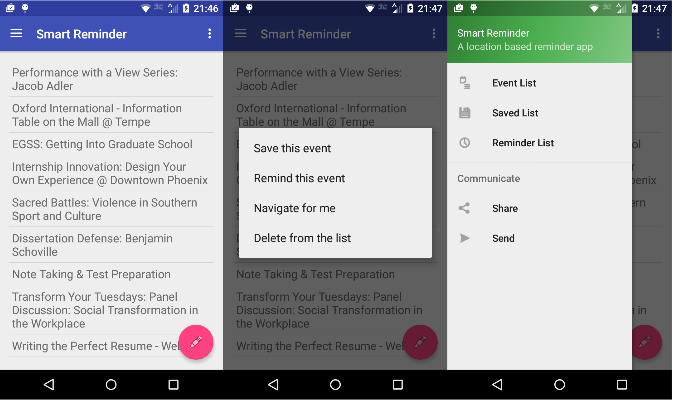
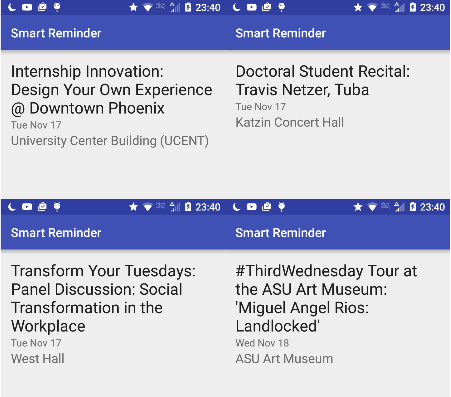
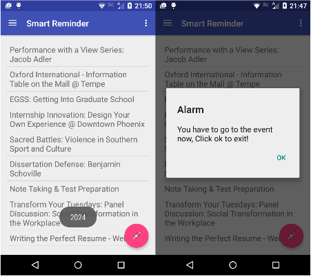
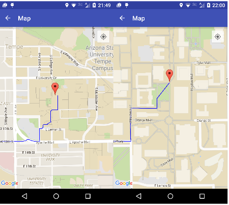

# Smart Reminder app
This is a project that for CES 535 that we aim to create an app that can remind you the event you will be interested in at ASU. We first scrap the data from ASU event website and convert into Json format, then our app can extract info from the Json file  
Here is some screen shots of our app:  
  
the screenshot for displaying event details:  
  
screen shot of alarm trigered: 
  
Navigation to event location based on google map: 
  